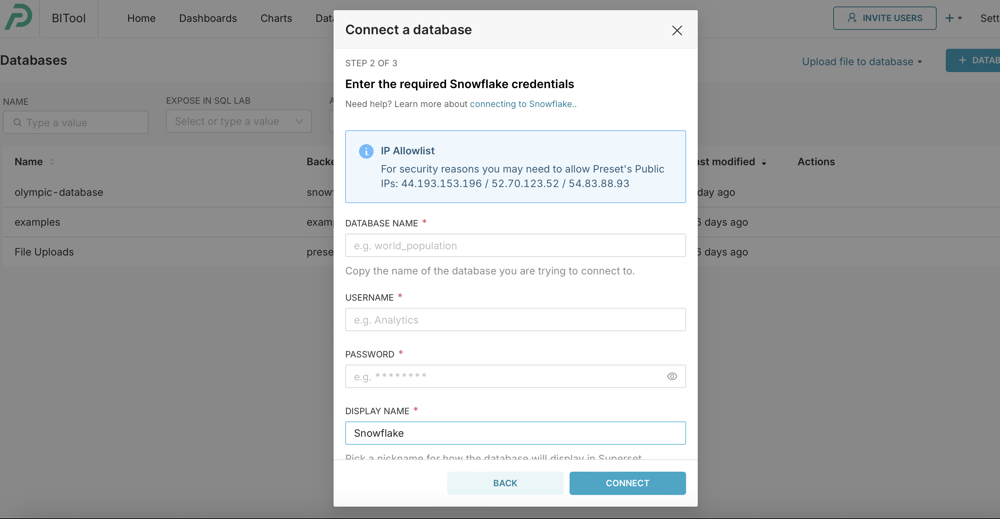
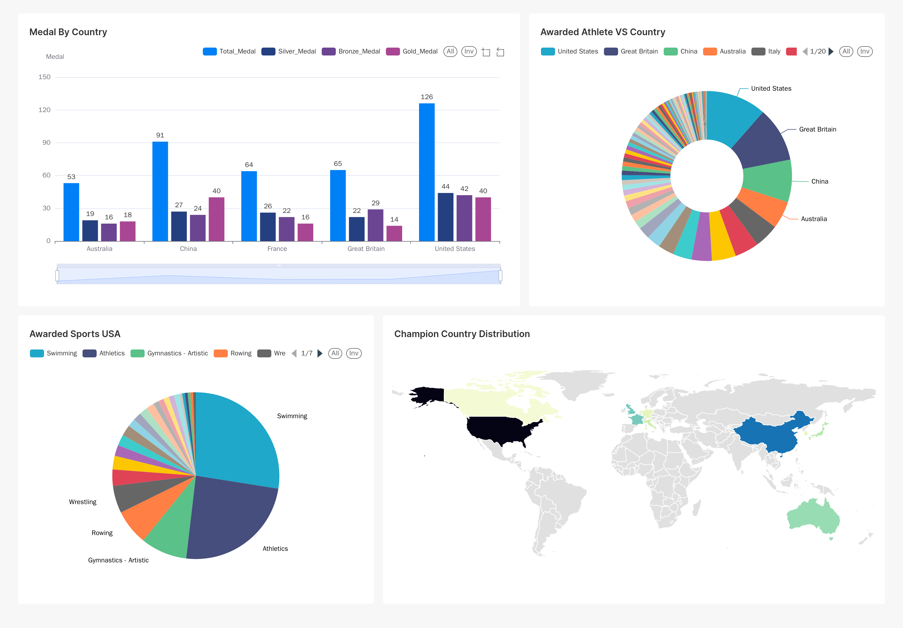

# Capstone-project


## Objective

The objective of this project is to gather and manage 2024 Olympic information, including results, medals, athletes, countries, schedules, and other relevant datasets. We will automate the ELT (Extract, Load, Transform) pipeline using data integration, transformation, and orchestration tools, and prepare analytical datasets for end users. This data will be stored across various data warehouses (raw, staging, marts) and organized through data models in the production environment, ensuring it is readily available for analytics and end-user insights.

## Consumers

The primary users of these datasets will be data analysts in different countries and Olympians around the world.

## Questions

> - The top five countries with the most medals in the 2024 Olympics
> - Followed with the question above, the types of sports where the top Olympic countries traditionally excel
> - Identify the geographic locations for these Olympic countries


## Source datasets

The data source is from Olympic sports API (olympic-sports-api.p.rapidapi.com). 
It includes Live Olympic results, athlete info, past Olympic records, medals, events, schedules, etc.

| Source name       | Source type | Source documentation  
| athletes          |   API       | Live Olympic Athlete info 
| countryid         |   API       | Live Olympic country info 
| medal by countryid|   API       | Live Olympic Medal info   
| medal by athletes |   API       | Live Olympic Medal info   
| results           |   API       | Live Olympic results info 
| schedule          |   API       | Live Olympic schedules    


## Solution architecture

How are we going to get data flowing from source to serving? What components and services will we combine to implement the solution? How do we automate the entire running of the solution?

- data extraction patterns: Source: Full Refresh | Destination: Overwrite/Append
- data loading patterns: Full Refresh/ Incremental
- data transformation patterns: Data type casting/group by/window function/aggregation function/join/renaming/sorting/flattening


## Getting started

1. Create a new snowflake account, conflunent account, aws root account, dagster cloud account, preset, etc

2. Install docker desktop, airbyte, dbt, dagster

3. There are a few parts which require intall different packages/library
    `pip install -r requirements.txt`
4. Clone the airbyte repo locally from `https://github.com/airbytehq/airbyte.git`

5. Execute `dbt init' to create a fresh new dbt project

6. Scaffold new dagster project 
```
dagster project scaffold --name dagster2
```
Then install other dependencies required for the dagster project

```
cd dagster2
pip install -e ".[dev]"
```


## Using airbyte

1. Start Docker Desktop
2. Navigate to the airbyte directory and execute the bash script to start airbyte
    cd integration/airbyte
   ```
   ./run-ab-platform.sh
   ```
3. Login to airbyte http://localhost:8000 using default username airbyte with password.
4. Create a new source and choose the custom API connector "Olympic Sports API - Overall"

    
5. Create a destination for the Snowflake database

    
6. Create a connection between Olympic Sports API and snowflake database

    
7. Run the sync job
8. Host airbyte on AWS EC2 instance named "my-airbyte"

    
9. Connect EC2 instance by SSH. Then install airbyte and start it

    
10. Repeat the process 3 to 7 just as running on the local machine but replace the localhost in http://localhost:8000 with EC2 public ip address.

    
    


## Using snowflake

1. Log in to the snowflake account
2. Go to projects -> worksheets -> + worksheet
3. On the top right, select the role ACCOUNTADMIN.
4. On the top left of the worksheet, select OLYMPIC.MARTS
5. Query one of the synced tables in MARTS, e.g. 
    ```
    select * from dim_medal_by_countryid
    ```


## Transformation using dbt

1. cd to transformation/olympicgame
2. Execute `dbt run`

    
3. Execute the command `dbt docs generate` to create the dbt documentations and `dbt docs serve` to create and view the lineage graph

    
4. Execute the command `dbt build` to run and test dbt models

## Orchestration using dagster

part1 running etl process using dagster on local machine
1. cd to orchestration/dagster2
2. Start airbyte by using command 
    ```
    ./run-ab-platform.sh 
    ```
3. Execute `dagster dev` to trigger dagster webserver and click reload all to load definition

    
4. Click "Assets" and then "Global Asset Lineage", "Materialize all" to run etl process

    
    
5. Successfully deployed.

    images/dagster_image/dagster_detail1.png
    
    
    

## Using Confluent

1. Log ino confluent
2. Create a new Environment and click on `+ Add Cluster`
3. Click into your environment and click on `+ Add Cluster`
4. Create a Topic named as 'olympic1' inside the cluster
5. Create a Python connector and configure the `bootstrap.server`. Replace the `client.properties` values accordingly.
   ```
   # Required connection configs for Kafka producer, consumer, and admin
   bootstrap.servers=your_cluster_bootstrap_server
   security.protocol=SASL_SSL
   sasl.mechanisms=PLAIN
   sasl.username=your_key
   sasl.password=your_secret
   ```
6. cd stream-data-integration and install the requirements
7. Execute commands in terminal
    ```
    python producer.py
    ```
8. The producer successfully push data into the topic

    
    

9. Set up consumer by going to the connectors and choose `Amazon S3 Sink`.
10. Configure the S3 Sink by using aws key /secret key /bucket name, etc and run it. 

    

## Using preset
1. Create a preset account
2. Create a workspace and connect to snowflake database. In order to read data from snowflake, a network policy is required to generate to allow the ip address.

3. Create different charts and add to dashboard

    


