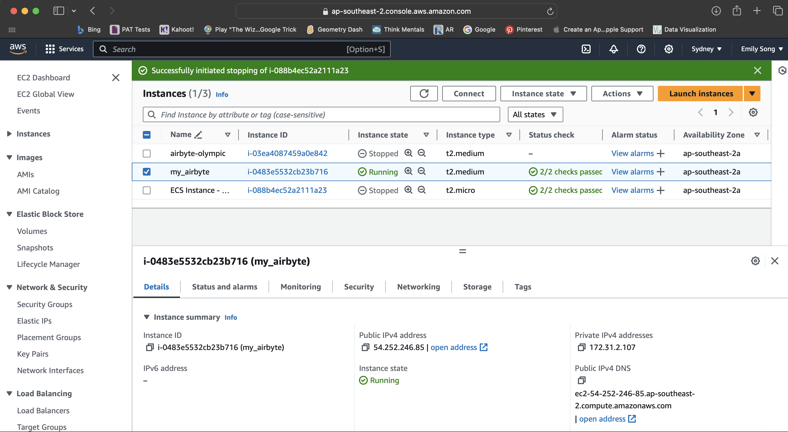

# Capstone-project


Using airbyte

1. Start Docker Desktop
2. Navigate to the airbyte directory and execute the bash script to start airbyte
    cd integration/airbyte
   ```
   ./run-ab-platform.sh
   ```
3. Login to airbyte http://localhost:8000 using default username airbyte with password.
4. Create a new source and choose the custom API connector "Olympic Sports API - Overall"
    
5. Create a destination for the Snowflake database
    
6. Create a connection between Olympic Sports API and snowflake database
    
7. Run the sync job
8. Host airbyte on AWS EC2 instance named "my-airbyte"
    
9. Connect EC2 instance by SSH. Then install airbyte and start it.
    
10. Repeat the process 3 to 7 just as running on the local machine but replace the localhost in http://localhost:8000 with EC2 public ip address.
    
    


Using snowflake

1. Log in to the snowflake account
2. Go to projects -> worksheets -> + worksheet
3. On the top right, select the role ACCOUNTADMIN.
4. On the top left of the worksheet, select OLYMPIC.MARTS
5. Query one of the synced tables in MARTS e.g. select * from dim_medal_by_countryid


Transformation using dbt

1. cd to transformation/olympicgame
2. Execute `dbt run`
    
3. Execute the command dbt docs generate to create the dbt documentations and dbt docs serve to create and view the lineage graph
    
4. Execute the command dbt build to run and test dbt models

Orchestration using dagster

part1 running etl process using dagster on local machine
1. cd to orchestration/dagster2
2. Start airbyte by using command ./run-ab-platform.sh 
3. Execute dagster dev to trigger dagster webserver and click reload all to load definition
    
4. Click "Assets" and then "Global Asset Lineage", "Materialize all" to run etl process
    
    
5. Successfully deployed.
    images/dagster_image/dagster_detail1.png
    
    
    


